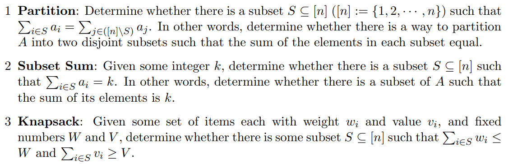

# 2. Some Sum

**Given an array $A = [a_1, a_2, . . . , a_n]$ of nonnegative integers.**
  

**If ask to find answer for Subset Sum with given integer $t$**

(a) Find a linear time reduction from *Subset Sum* to *Partition*.

1. $\sum A = s, a_p = |s-2t|$
2. $A' = A + [a_p], \sum A' = \left\{\begin{aligned}
    & 2s-2t , \text{ if } s-2t \geq 0\\
    & 2t, \text{ if } s-2t \leq 0
\end{aligned}     \right.$
3. Now if we do *partition* on $A'$.
   1. If $s-2t \geq 0$, we get two array equal to $s-t$ and one must contain element $a_p$, Which make the left sum if $s-t-(s-2t)=t$
   2. If $s-2t \leq 0$,  we get two array equal to $t$ and one must not contain element $a_p$.
4. By doing above step, we can get answer for *Subset Sum*, so we can reduce problem from *Subset Sum* to *Partition*.

(b) Find a linear time reduction from *Subset Sum* to *Knapsack*

1. For each item $i$ in A, create an new array with wight $w_i=i$ and value $v_i=i$.
2. Do *Knapsack* on this new array with $W=t,V=t$
3. Since $W=V$, we get (Sum of chosen weights) $=$ (Sum of chosen values) $=$ $t$, And since each weight/value pair is exactly the value of one of the original elements of $A$. The answer is also for *Subset Sum*.
4. By doing above step, we can get answer for *Subset Sum*, so we can reduce problem from *Subset Sum* to *Knapsack*.