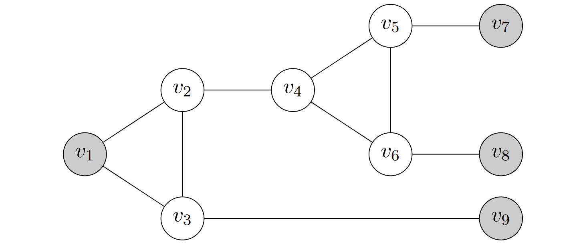

## 2. Vertex Cover to Set Cover

Give an efficient reduction from the minimum vertex cover problem to the minimum set cover problem. Briefly justify the correctness of your reduction (i.e. 1-2 sentences).

1. Let $U$ be the union of all the edges in $G$.
2. for all $u$ in $V$, set $S_u$ is all the edges incident to $u$.

Then we have reduced MVC to MSC.

## 3. Reduction to 3-Coloring

Give a reduction from 3-SAT to the 3-coloring problem.
In our reduction, the graph will start with three special vertices, labelled $v_{\text{TRUE}}$, $v_{\text{FALSE}}$, and $v_{\text{BASE}}$, as well as the edges $(v_{\text{TRUE}}, v_{\text{FALSE}})$, $(v_{\text{TRUE}}, v_{\text{BASE}})$, and $(v_{\text{FALSE}}, v_{\text{BASE}})$.

(a) For each variable $x_i$ in a 3-SAT formula, we will create a pair of vertices labeled $x_i$ and $\neg x_i$. How should we add edges to the graph such that in any valid 3-coloring, one of $x_i$, $\neg x_i$ is assigned the same color as $v_{\text{TRUE}}$ and the other is assigned the same color as $v_{\text{FALSE}}$?

We add edges $(x_i,\neg x_i), (x_i, v_{\text{BASE}}), (\neg x_i, v_{\text{BASE}})$, since any vertex adjacent to $v_{\text{BASE}}$ must have color as either $v_{\text{TRUE}}$ or $v_{\text{FALSE}}$.

(b) Consider the following graph, which we will call a “gadget”:
  

Assigns each vertex a color from $\{red, green, blue\}$. Consider any valid 3-coloring of this graph that does not assign the color blue to any of the gray vertices $(v_1, v_7, v_8, v_9)$. Show that if $v_1$ is assigned the color green, then at least one of $\{v_7, v_8, v_9\}$ is assigned the color green.

Use contrapositive:

1. Cause $v_1$ is assigned to green.
2. If nether $\{v_7,v_8,v_9\}$ is green and blue, then means they are all red.
3. $\therefore v_4 $ must be red, $v_3$ must be blue, $\Rightarrow v_2$ must be red.
4. $v_2$ and $v_4$ are both red, which against our definition.

(c) Use (a) and (b) to reduce 3-SAT to 3-coloring.

1. Given a 3-SAT instance, we create the three special vertices($v_{\text{TRUE}}$, $v_{\text{FALSE}}$, and $v_{\text{BASE}}$) and edges described in the problem statement.
2. For all variables in 3-SAT, create vertices $x_i, \neg x_i$, and combined them like (a).
3. for each clause in 3-SAT, considered as $C_j$, add edges between $(C_j$, $v_{\text{FALSE}})$, and $(C_j,v_{\text{BASE}})$, this guaranteed it must be true.
4. Make 3-color from $\{red, green, blue\} \to \{False, True, Base\}$.
5. for each clause $C_j$, we create a gadget with $v_1$ is $C_j$, and $\{v_7,v_8,v_9\}$ is the vertices of three literals in the clause. This guaranteed at least one literal is true.
6. Then in this graph, if there is a valid 3-coloring, there is a satisfying 3-SAT assignment.

## 4. $k$-XOR

In the $k$-XOR problem, we are given $n$ boolean variables $x_1, x_2, . . . , x_n$, a list of $m$ clauses each of which is the XOR of exactly $k$ distinct variables (that is, the clause is true if and only if an odd number of the $k$ variables in the clause are true), and an integer $r$. Our goal is to decide if there is some assignment of variables that satisfies at least $r$ clauses.

(a) In the Max-Cut problem, we are given an undirected unweighted graph $G = (V, E)$ and integer $c$ and want to find a cut $S \subseteq V$ such that at least $c$ edges cross this cut (i.e. have exactly one endpoint in S). Give and argue correctness of a reduction from Max-Cut to 2-XOR.

1. Consider every clause in 2-XOR as an edge in Max-Cut, and two variables inside each clause is the vertexes for this edge.
2. Only odd variables is true means only one vertex is in cut S.
3. Make $r==c$, then solve the 2-XOR also solve Max-Cut.

(b) Give and argue correctness of a reduction from 3-XOR to 4-XOR.

Simply add an False for every clause. The answer for 4-XOR is the same for 3-XOR.
If add an True for every clause, then negating all other variables for 4-XOR, we can also get the answer for 3-XOR.
