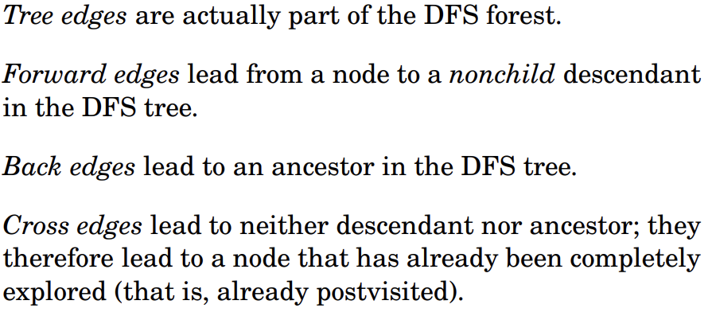
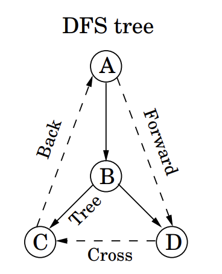
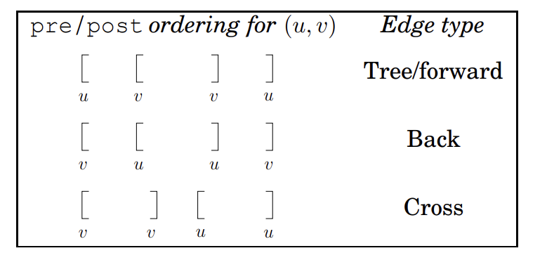

## 2. Distant Descendants

**Backgroud:** 

* Given a tree $T$ with a root node $r$ and a positive integer $K$.
* For a specific vertex $v$, $s[v]$ is the number of children that are distance at least $K$ from $v$.
  
Give an $\Omicron(|V|)$ algorithm to output $s[v]$ for every $v$:

* Hint: start from leaf, so we can reuse some information.

$\therefore$ $$s[v] = \sum_{c \in v.child}s[c] + \#\text{vertexes exacly k away}$$

in order to not doing DFS multiple times, we store the k away ancestor information of every vertex instead of its k away descendant.

**Runtime:** $\Omicron(|V|)$

## 3. Where is the Graph?

(a): Ask for finding all reliable vertexes in a directed graph which you can leave it along some road and return back along another road.

We can easily see it is asking for SCCS, so just use SCCS algorithm.

**Algorithm:**

1. Run SCCs(G)
2. Find SCCs groups who have at least two vertexes.
3. Out put all vertexes in those SCCs group.

**Runtime:** $\Omicron(V+E)+\Omicron(V) = \Omicron(V+E)$

(b): Given a Tree graph(one node only has one parent), and two distinct vertex $a,b$.

**Background:** we have run DFS or BFS on this tree so that every vertex can have some information.
Based on this, ask for an constant time algorithm to figure out weather they has blood relationship.

1. Run DFS(G), store pre and post time. $\to \Omicron(V)$
2. Compare $a$ and $b$ their pre and post time. $\to \Omicron(1)$

(c): Given a DAG, ask to find shortest path, just update vertex by topological order.$\to \Omicron(V)$

## 4. Semiconnected DAG

**Terminology explanation:** A DAG graph G is *semiconnected* if for any two vertices $A$ and $B$, there is a path from $A \to B$ or a path from $B \to A$

Prove the theorem that $G$ is semiconnected if and only if there is a directed path that visited all of the vertices of $G$.

①：prove if $G$ is semiconnected, then there has a directed path:
$\because$ Definition of semiconnected and visit vertices by topological order, we can easily see that previous node must connext to next node.
$\therefore$ there is a directed path.

②: prove if there has a directed path, then $G$ is semiconnected:
$\because$ for random node $a$ and $b$, use the given directed path, it must has $a \to b$ or $b \to a$
$\therefore G$ is semiconnected.

## 4. 2-SAT

**Example:** $x_i$ is a Boolean variable, find one combination that output True. $\Leftrightarrow$ there is at least one true in each clause.
$$(x_1 \lor \bar{x_2}) \land (\bar{x_1} \lor \bar{x_3}) \land (x_1 \lor x_2) \land (\bar{x_3} \lor x_4) \land (\bar{x_1} \lor x_4)$$

**One possible output:** $X=[T,F,F,T]$

For a 2SAT problem with $n$ variables and $m$ clauses, we can reducing it to a directed graph $G_I = (V,E)$, and find its SCCs.

* $G_I$ has 2n nodes, one for each variable and its negation.
* $G_I$ has 2m edges: for each clause $(\alpha \lor \beta)$ of $I$, $G_I$ has edge $\bar{\alpha} \to \beta$ and $\bar{\beta} \to \alpha$

(a) If $G_I$ has a SCCs contains both $x$ and $\bar{x}$ for some variable, then $I$ has no satisfying assignment.
$\because x \to \bar{x}$ and $\bar{x} \to x$ means $x$ is both True and False, don't exist.

(b) If none of $G_I$'s SCCs has (a), then the instance I must be satisfiable.

(c) This ends uo discovering a satisfying assignment:
Assign values to variables as follows:

* repeatedly pick a sink SCCs of $G_I$. Assign value **true** to all literals in the sink, assign **false** to their negations, and delete all of them.

## coding
  
  
  

