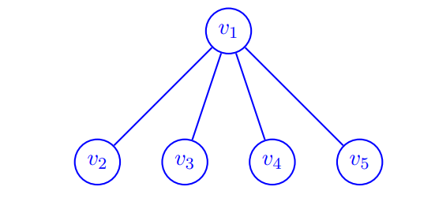
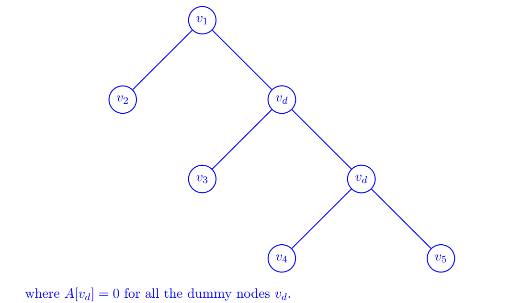

## 2. Egg Drop Revisited

Instead of solving for $f(n, m)$ directly, we define a new subproblem $M(x, m)$ to be the maximum number of floors for which we can always find $l$ in at most $x$ drops using $m$ eggs.  
For example, $M(2, 2) = 3$ because a 3-story building is the tallest building such that we can always find $l$ in at most 2 drops using 2 eggs.

(a) Recurrence relation for $M(x, m)$ that can be computed in constant time.

* Define $opt\_ floor(x,m) :=$ the optimal floor from which we will drop the first egg given we have $x$ drops and $m$ eggs.

1. If first drop egg at $opt\_ floor(i,j)$ break, then we know that $l<opt\_ floor(i,j)$ and $M(i-1,j-1)$ is the max building we can find $l$ with left drop and eggs.   
$\therefore opt\_ floor(i,j)-1 = M(i-1,j-1)$
2. If first drop egg at $opt\_ floor(i,j)$ not break, then we know that $l>opt\_ floor(i,j)$, and $M(i-1,j)$ is the max building we can find $l$ with left drop and eggs.  

$\therefore M(i,j)=M(i-1,j) + opt\_ floor(i,j)$
$$
\therefore M(i,j)=M(i-1,j) + M(i-1,j-1) + 1
$$
If we first drop at $opt\_ floor(i,j) = M(i-1,j-1) + 1$

(b)
base case: $M(i,j) = 0\quad \text{if one of them is 0}$.
**Runtime:** $\Omicron(xm)$
**Memory Space:**$\Omicron(xm)\to \Omicron(m)$
(c)
$$f(n,m) = min(x \text{ for } M(x,m)\geq n)$$
So we can easily compute all $M(x,m)$ and check its value with $x$ increase for $x\in [1,n]$.

```python
for x in range(1,n+1):
    compute M(x,m)
    if M(x,m) >= n:
        return x
```

**Runtime:** $\Omicron(nm)$

(f) If each egg has 2 lives.
Let $M_1(x, m)$ be $M(x, m)$ when the $m^{th}$ egg has 1 life left, and $M_2(x, m)$ be $M(x, m)$ when the $m^{th}$ egg has 2 lives left.
$\therefore$
$$\begin{aligned}
M_1(i,j) & = M_1(i-1,j) + M_2(i-1,j-1) +1 \\
M_2(i,j) & = M_1(i-1,j) + M_2(i-1,j) +1
\end{aligned}
$$

Or we can think it as double the number of our eggs, thus we can simply return $M(x,2m)$.

## 3. Knightmare

Give a dynamic programming algorithm to find the number of ways you can place knights on an $L$ by $H$ $(L < H)$ chessboard such that no two knights can attack each other (there can be any number of knights on the board, including zero knights). Knights can move in a $2 × 1$ shape pattern in any direction.

**Subproblem:**
$f(h,u,v)$ return the the number of possible valid configurations of the first $h$ rows with $u$ being the configuration of the $(h − 1)^{th}$ row and $v$ being the configuration of the $h^{th}$ row.

**Recurrence Cases:**
$$f(h,v,w)=\sum_{u:u,v,w\text{ are valid}}f(h-1,u,v)$$

Base Case: When only 2 rows  $f(h,v,w) = 1$ if $v,w$ are valid, else 0.

**Runtime:**
Each row we use length L bit strings to represent the configuration of rows of the chessboard (1 means there is a knight in the corresponding square and otherwise 0), so it have $2^L$ possibility for each row.
```python
for h in range(H): # O(H)
    Loop u,v,w: # O(2^3L)
        check all L knight in h row whether valid. # O(L)
```
$\therefore $ total runtime: $\Omicron(2^{3L}HL)$

## 4. Max Independent Set Again

Given a connected tree $T$ with $n$ nodes and a designated root $r$, where every vertex $v$ has a weight $A[v]$. A set of nodes $S$ is a k-independent set of $T$ if $|S| = k$ and no two nodes in $S$ have an edge between them in $T$. The weight of such a set is given by adding up the weights of all the nodes in S, i.e.
$$w(S)=\sum_{v\in S}A[v]$$
Ask to find the maximum possible weight of any k-independent set of $T$.

(a) T is a binary tree.
**Subproblem:** $f(v,k)$ return the maximum weight of k-independent set start with root $v$.
$f_1(v,k)$ means $v$ can be put in $S$, and $f_0(v,k)$ means can not.
**Recursion Relationship:**
$$\begin{aligned}
   & f_0(v,k) = \underset{j\in [0,k]}{max}(
\begin{aligned}
    & f_1(v.left,j) + f_1(v.right, k-j)
\end{aligned}) \\
\\
& f_1(v,k) = \underset{j\in[0,k-1]}{max} \left \{
\begin{aligned}
    & f_0(v,k) \\
    \\
    & w(v) + f_0(v.left,j)+f_0(v.right,k-1-j)
\end{aligned}
\right.
\end{aligned}
$$
**Runtime:** $\Omicron(2 \cdot nk \cdot k)=\Omicron(nk^2)$

(b) Consider any arbitrary tree $T$, with no restrictions on the number of children per node.

* Hint: reduce arbitrary tree into binary tree.
  
  

But in this binary tree we can pick $v_1$ and $v_3$, which will break our correctness.

$\therefore$ when a dummy node $v_d$ can be choose, we will set all its children be $f_1$, and all its children be $f_0$ if this $v_d$ can't be choose. This will make our algorithm correct.

(c)
If arbitrary tree has n nodes, and we reduce it into binary will need add $\Omicron(n)$ dummy nodes. So the new binary tree will have $\Omicron(2n)$ nodes. This time we run (a), the runtime will be $\Omicron(n) + \Omicron(2nk^2) = \Omicron(nk^2)$