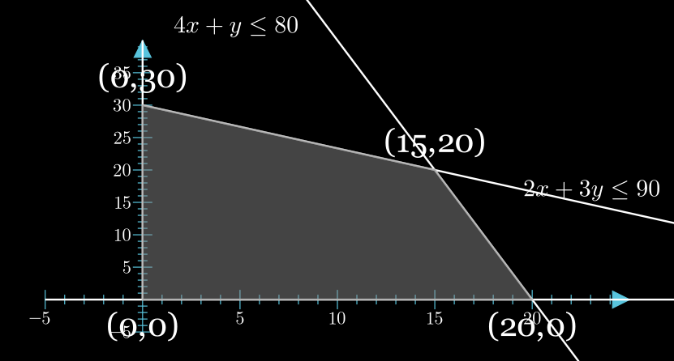

## 2. Canonical Form LP

For each of the subparts below, describe how we should modify it to so that it satisfies canonical form. If it is impossible to do so, justify your reasoning. Note that the subparts are independent of one another.

(a) Min Objective: min $\sum_ic_ix_i\Rightarrow$ max $\sum_i-c_ix_i$

(b) Lower Bound on Variable: $x_1 \geq b_1 \Rightarrow -x_1\leq b_i$

(c) Bounded Variable: $b_1 ≤ x_1 ≤ b_2 \Rightarrow x_1 \leq b_2 \text{ and } -x_1 \leq -b_1$

(d) Equality Constraint: $x_2 = b_2 \Rightarrow x_2 \leq b_2 \text{ and } -x_2 \leq -b_2$

(e) More Equality Constraint: $x_1 + x_2 + x_3 = b_3 \Rightarrow x_1 + x_2 + x_3 \leq b_3 \text{ and } -x_1 - x_2 - x_3 \leq -b_3 $

(f) Absolute Value Constraint: $|x_1 + x_2| \leq b_2 \text{ where }x_1, x_2 \in \mathbb{R} \Rightarrow$

1. $x_1+x_2 \leq b_2 \text{ and } -x_1-x_2 \leq b_2$
2. $\because x_1, x_2 \in \mathbb{R}$, we need some way to enforce them to non-negative, by using $x_1 = x_1^+ -x_1^-, x_2 = x_2^+ -x_2^-$
3. $\therefore x_1^+ -x_1^- + x_2^+ -x_2^- \leq b_2 \text{ and } -x_1^+ +x_1^- - x_2^+ +x_2^- \leq b_2$

(g) Another Absolute Value Constraint: $|x_1 + x_2| ≥ b_2 \text{ where } x_1, x_2 ∈ \mathbb{R} \Rightarrow$

1. $x_1+x_2 \geq b_2 \text{ or } -x_1 - x_2 \geq b_2$
2. An LP can only represent an intersection (not union) of constraints. In other words, it is impossible because we cannot have both $x_1 + x_2 ≥ b_2$ and $x_1 + x_2 ≤ −b_2$ hold at the same time (unless $b_2$ = 0).
3. $\therefore$ it's impossible

(h) Min Max Objective: min max$(x_1, x_2) \Rightarrow$

1. let max$(x_1,x_2) = t$
2. $\therefore x_1 \leq t, x_2 \leq t$
3. max $-t$

(i) Unbounded Variable: $x_4 ∈ \mathbb{R} \Rightarrow x_4 = x_4^+ - x_4^-$

## 3. Baker

(a)
$$
\begin{aligned}
    max \quad 60x+30y \\
    4x+y \leq 80 \\
    2x+3y \leq 90 \\
    x \geq 0, y \geq 0
\end{aligned}
$$
  
Using simplex we can easily figure out $(15,20)$ maximized $60x+30y = 1500$

(b)
Want max $ Cx + 30y, C \geq 0$
$\therefore$
$$ \begin{aligned}
    (0,30), \text{ if } C \in [0,20] \\ 
    (15,20), \text{ if } C \in [20,120] \\ 
    (20,0), \text{ if } C \in [120,\infty] \\ 
\end{aligned}$$

## 4. Meal Replacement

(a) **LP:**
$$
\begin{align}
    min \quad 6x+y+8z \notag \\
    400x+50y+300z \geq 600 \\
    300y+100z \geq 800 \\
    150x+25y+200z \geq 500 \\
    x \geq 0, y \geq 0, z \geq 0
\end{align}
$$

(b) **Dual:**
(1)*a+(2)*b+(3)*c
$$
\begin{align}
   max \quad 600a+800b+500c \notag \\
    400a+150c \leq 6 \\
    50a+300b+25c \leq 1 \\
    300a+100b+200c \leq 8 \\
    a\geq0,b\geq0,c\geq0
\end{align}
$$

(c) The answer is part (b)'s Dual.

## 6. Huffman and LP
$$
\begin{align}
    max \quad f_a+2f_b+3f_c& +4f_d \notag\\
    f_a+f_b+f_c+f_d = 1 \tag{fractions add to 1 }\\
    f_a \geq f_b \geq f_c,f_d \tag{first merge c and d}\\
    f_a \geq f_c+f_d \tag{second merge b and (c,d)} \\
    f_a,f_b,f_c,f_d \geq 0 \notag
\end{align}
$$

## 7.  Flow Decomposition
Just *Ford-Fulkerson*