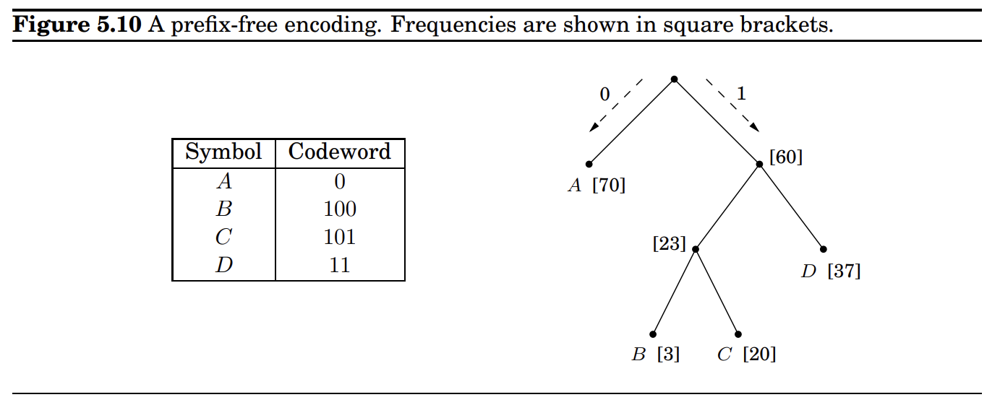
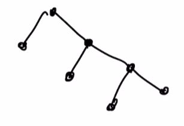

## 1. Kruskal's Algorithem

**Review:** 
given a graph with $n$ vertexes and $m$ edges.

1. sort all edges from lightest. $\to \Omicron(m\log m)$
2. pop the lightest edge and add it to MST if it don't create a cycle. $\to \Omicron(m\log ^*n)$ if using union-find date structure.
3. stop if MST has $n-1$ nodes.

(a) How dose the algorithm changed with negative edges?
no influence. Because the cut theory still hold for negative edge.

(b) in dijkstra's algorithm, if we have negative edges, can we add constant number to every edge to make it positive?
no, you can't add constant number to all edges and use dijkstra. Because more deeper node will get more contribution(several times) of this constant number.

(c) consider a DAG, what's the different between dijkstra and topo-sort?
they are different algorithms.
**topo-sort:** 

1. pick the node that has minimizes outgoing edges. 
2. run DFS-like from this node, pushed this node to stack only when all of its adjacent vertices (and their adjacent vertices and so on) are already in the stack.
3. print(stack[::-1])  # return list in reverse order.

(d) given a MST, how to mess up it by adding a new vertex $u$
set node $u$ to connect all other vertexes, and their edge's weight < min value, this will take over the MST.

## 2. Bellman–Ford algorithm

**Review:** find shortest path in graph, slower than dijkstra, but can handle negative situation.

* just simply relaxes(updates) all the edges(in arbitrary order), and does this |V|-1 times.

**PS:** when update, using old value or current value doesn't matter, all is fine.

(a) Suppose $G$ has no cycles of negative total weight. Prove that for any pair of vertices $u,v$, there is a shortest path that has most $n-1$ edges.

**Sol:** if has more than $n-1$ edges, means that at least one vertex visited twice, also means has a cycle, and the weight is not negative, so cut the cycle will absolutely reduce to a more shorter path.

(b) If a n-edges-path is shorter than (n-1)-edges-path, it means $G$ has negative cycle.

(c) Define $d_k(v)$ to be the distance between source node $s$ to $v$. In $G$ has no cycles of negative total weight, what's $d_k(s)$ for $k\geq 0$. And what is $d_1(v)$ if $v$ is the neighbor of $s$.

**Sol:** $d_k(s) == 0, d_1(v)=weight(s,v)$

(d) $d_k(v) = min(d_{k-1}(u) + weight(u,v))$, 
base case: $d_0(s) = 0, d_0(\text{other\_node})=\infty$

## 4. Horn Formula Practice

**Review:**
Horn formulas are a particular framework for expressing logical facts and deriving conclusions.

1. **Implications**, whose left-hand side is an AND of any number of positive literals and whose right-hand side is a single positive literal. These express statements of the form “if the conditions on the left hold, then the one on the right must also be true.” For instance,
$$(z \land w) \Rightarrow u $$
2. **Pure negative clauses**, consisting of an OR of any number of negative literals, as in
$$(\bar{u} \lor \bar{v} \lor \bar{y})$$
means they can't all be false.
3. algorithm for Horn clauses is the following greedy scheme
    * 1. set all variables to false
    * 2. while there is an implication that is not satisfied, set the right-hand variable of the implication to true
    * 3. if all pure negative clauses are satisfied: return the assignment else: return ''formula is not satisfiable''

(a) Find the variable assignment that solve the following horn formula:
$$(x\land z)\Rightarrow y, z \Rightarrow w, (y \land z) \Rightarrow x, \Rightarrow z, (\bar{z} \lor \bar{x}), (\bar{w}\lor \bar{y} \lor \bar{z}) $$
$\because$ nothing implies $z$ ($\Rightarrow z$), $\therefore z = True$
$\because$ $z$ implies $w$ ($z \Rightarrow w$), $\therefore w = True$
$\because (\bar{w}\lor \bar{y} \lor \bar{z}) = True$ $\therefore y = False$
$\because (\bar{z} \lor \bar{x}) = True$ $\therefore x = False$

(b) Show that any implication clause of the form $(x_i \lor x_j \lor \cdots )\Rightarrow True$ is always satisfiable.

$\because a \Rightarrow b$ can be also represented as $(\bar{a} \lor b)$, so if $b$ is True, then the implication will always be satisfied.

(c) Show that ant implicatioj clause of the form $False \Rightarrow x_k$ is always satisfiable.

$\because False \Rightarrow x_k \to (True \lor x_k) == True$

## 3. Longest Huffman Tree

Under a Huffman encoding of $n$ symbols with frequencies $f_1, f_2,\cdots,f_n$, what is the longest a codeword could possibly be? Give an example set of frequencies that would produce this case, and argue that it is the longest possible.

**Review:** Huffman encoding $\to$ using *tries* to encoding depend on every simple's frequency.
  

1. Find the two symbols with the smallest frequencies, say $i$ and $j$, and make them children of a new node, which then has frequency $f_i + f_j$.
2. The latter problem is just a smaller version of the one we started with. Recursively do step 1 on new nodes $(f_j + f_i),\cdots, f_n$

So the worst case is that the new node still be the smallest.  

$\therefore $ the longest tree is height == n-1

## 5. Doctor

(a) In order to minimize the average waiting time, we need to sort the customers by increasing $t(i)$

(b) if the order of customer is $x_1,x_2,x_3,\cdots, x_n$, by doing the following modification will not increase the average waiting time:

* If $ i < j$ and $t(x_i) > t(x_j)$, swap the order of $x_i \text{ and } x_j$

(c) part(a)'s order is optimal.

## 7. Prim and Kruskal on MST

**Review for prim:**

1. Start at a arbitrary node.
2. Choose the lightest one in the edges current MST set can travels into, don't cause cycle $\rightleftharpoons$ don't travel to visited nodes(can't use this process in kruskal).
   * Implement:
   * 1. have a priority queue start with edges for $s$
   * 2. pop the lightest one, add the edges the new node $u$ travelable.
3. till all vertexes are in MST.

## 5. MST Basics

Given undirected and connected $G=(V,E)$

(a) Let e be any edge of minimum weight in G. Then e must be part of some MST.$\to $True dul if we using kruskal.

(b) If e is part of some MST of G, then it must be a lightest edge across some cut of G. $\to $ True, according to cut theory.

(c) If G has a cycle with a unique lightest edge e, then e must be part of every MST. $\to $ False, may can use outside smaller edges.

(d) For any r > 0, define an r-path to be a path whose edges all have weight less than r. If G contains an r-path from s to t, then every MST of G must also contain an r-path from s to t. $\to $ True, or i should choose the smaller one, which is r-path.

