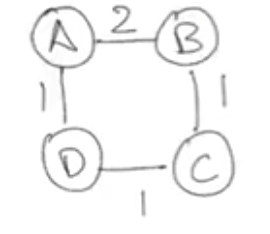
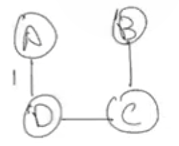
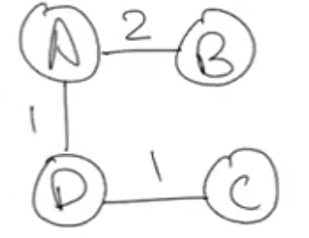

## 1.Prim's Tutorail

### prim's Algorithm

**General Idea:**

* Cut theory
* Choose the lightest cross edge

```python
def prims(G=(V,E),s)
    T = []
    visited = set(s)
    edges_PQ = 'have a priority queue start with edges for s'

    while visited != V:
        (u,v) = edges_PQ.popmin() # pop the lightest edge
        edges_PQ.add('add the edges the new node v travelable.')
        T.append((u,v))
        visited.add(v)
    
    return T
```

**Runtime of Prim's**

* $\Omicron((|E|+|V|)\log |V|)$ using a binary min-heap
* $\Omicron(|E|+|V| \log |V|)$ using a fibonacci min-heap

**Prim's is very similar to Dijkstra's. Below Graph  show the different:**
  

* Prim's output:
  

* dijkstra's output:
  

## 2. Worst-case Instance for Greedy Set-Cover

Minimize the number of subsets to cover all elements in the universe.

**Greedy:** choose the set that has max elements that haven't covered yet.
  
this greedy will perform bad.

## 3. Independent Set Approximation

Given a sort of Graph, want to choose the largest subset of vertices such that no tow vertices in the subset are connected by an edge.
**Example:**
  
 
suppose each node has degree $\leq d$
**Algorithm:**

1. add an arbitrary node, and remove all its neighbor nodes and itself out of Graph.$\to $ add size $1$, remove graph $\leq d+1$
2. repeat step 1 until graph is empty.

$\therefore$The size of Independent Set is $\geq \dfrac{|V|}{d+1}\geq\dfrac{|OPT|}{d+1}$

## 4. Dynamic Programming Introduction: Fibonacci Numbers.

```python
def fib(n):
    if n <= 1:
        return n
    return fib(n-1) + fib(n-2)
```

(a) **Runtime:** $\Omicron(2^n)$ $\Theta((\frac{1+\sqrt{5}}{2})^n)$

(b) using memorization to update fib

```python
def fib_dp(n)
    mem = [None for _ in range(n+1)]
    # base case
    mem[0] = 0
    men[1] = 1

    def fib(n):
        if mem[n] != None:
            return men[n]
        else:
            men[n] = fib(n-1) + fib(n-2)

    return fib(n)
```

**Runtime:** $\Omicron(n)$
**memory:** $\Omicron(n)$

(c) update to bottom-up in order to save memory

```python
def dib_dp_bottom_up(n)
    mem = [0,1] # base case
    if n <= 1:
        return mem[n]

    for i in range(2, n+1):
        new_fib = men[0] + men[1]
        mem[0] = men[1]
        mem[1] = new_fib
    
    return new_fib
```

**Runtime:** $\Omicron(n)$
**memory:** $\Omicron(1)$

