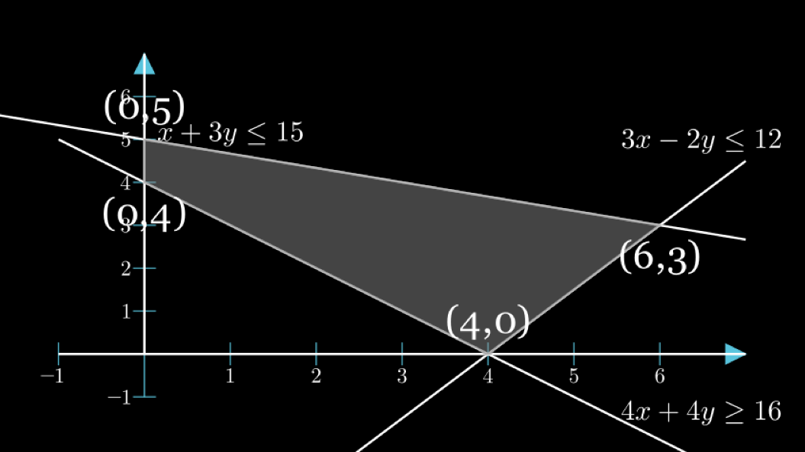
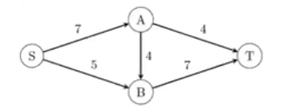
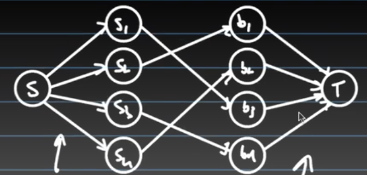

## 1. Simply Simply

Considering the following LP Problem:
$$
max \text{ } 5x+4y \\
\text{subject to } \left\{
\begin{aligned}
    & x+3y \leq 15 \\
    & 3x-2y \leq 12 \\
    & 4x+4y \geq 16 \\
    & x \geq 0, y \geq 0
\end{aligned}
\right.
$$

(a) Sketch the feasible region.
  

(b) Simulate the Simplex algorithm on this LP.
we want maxsize $5x+4y$

1. Start at (0,4), calculate the value =16
2. Find the neighboring vertices, which are (0,5) and (4,0)
3. Calculate each vertexes value, which is (0,5) = 20, (4,0) = 20
4. Move to the largest one, if none of them larger them itself, done, otherwise loop step 2 and 3.

$(6.3)\Rightarrow 42$

## 2. Job Assignment

Given $I$ people to work with $J$ jobs, the salary for person $i$ working one day at job $j$ is $a_{ij}$,  Each job is completed after the sum of the time of all workers spend on it add up to be 1 day, though partial completion still has value (i.e. person $i$ working c portion of a day on job $j$ is worth $a_{ij}c$). The problem is to find an optimal assignment of jobs for each person for one day such that the total value created by everyone working is optimized. No additional value comes from working on a job after it has been completed.

(a) What variables should we optimize over? I.e. in the canonical linear programming definition, what is $x$

$x_{ij}$ is the protion working time for person $i$ on job $j$

(b)What are the constraints we need to consider? Hint: there are three major types.

$$
\forall i,j \quad x_{ij} \geq 0  \\
\sum_{j=1}^J x_{ij} \leq 1 \text{ a person don't work more than one day}\\
\sum_{i=1}^I x_{ij} \leq 1 \text{ a work will not be overwork}
$$

(c) What is the maximization function we are seeking?
$$max \sum_{i,j} a_{ij}\cdot x_{ij}$$

## 3. Max-Flow Min Cut Basics

(a) If all edge capacities are distinct, the max flow is unique.
False, consider start edge is small and others is very big, then start flow could have many ways to flow out.

(b) If all edge capacities are distinct,the min cut is unique.
False, added together will be equal 

(c) If all edge capacities are increased by an additive constant,the min cut remains unchanged.
False, cause the cut value increasing depend on its edge's number.

(d) If all edge capacities are multiplied by a positive integer, the min cut remains unchanged.
True.

(e) In any max flow, there is no directed cycle on which every edge carries positive flow.
False.

(f) There exists a max flow such that there is no directed cycle on which every edge carries positive flow.
True.

## 3. Residual in graphs

**Review of Ford-Fulkerson Algorithm:**
Main idea: use *Residual graph* to find augmenting path.

1. Start with initial flow as 0.
2. While there exists an augmenting path from the source to the sink:  
   * Find an augmenting path using any path-finding algorithm, such as breadth-first search or depth-first search.
   * Determine the amount of flow that can be sent along the augmenting path, which is the minimum residual capacity along the edges of the path.
   * Increase the flow along the augmenting path by the determined amount.
3. Return the maximum flow.

**Max-flow min-cut theorem:** The size of the maximum flow in a network equals the capacity of the smallest cut.

## 5. Max Flow, Min Cut, and Duality

Consider the max flow of the following graph:
  
Let $f_1$ be the flow pushed on the path $\{S,A,T\}$, $f_2$ be the flow pushed on the path $\{S,A,B,T\}$, and $f_3$ be the flow pushed on the path $\{S,B,T\}$. The following is an LP for max flow in terms of the variables $f_1,f_2.f_3$:
$$
\begin{align}
 max \quad f_1+f_2+f_3 \notag \\
 f_1+f_2\leq 7 \tag{Constraint for (S,A)} \\
 f_3\leq 5 \tag{Constraint for (S,B)} \\
 f_1\leq 4 \tag{Constraint for (A,T)} \\
 f_2\leq 4 \tag{Constraint for (A,B)} \\
 f_2+f_3\leq 4 \tag{Constraint for (B,T)} \\
 f_1,f_2,f_3\geq 0 \notag
\end{align}
$$
 
(a)
The canonical form of a linear program is
$$\begin{aligned}
    \text{maximize } & c^Tx \\
    \text{subject to } & Ax \leq b \\
    & x \geq 0
\end{aligned}
$$
$$\therefore x = \begin{bmatrix}
    f_1\\ f_2\\f_3
\end{bmatrix}, c = \begin{bmatrix}
    1 \\ 1 \\ 1
\end{bmatrix}, A = \begin{bmatrix}
    1&1&0\\
    0&0&1\\
    1&0&0\\
    0&1&0\\
    0&1&1
\end{bmatrix}, b = \begin{bmatrix}
    7\\5\\4\\4\\4
\end{bmatrix}
$$
The dual of the canonical LP is

$$\begin{aligned}
    \text{minimize } & y^Tb \\
    \text{subject to } & y^TA \geq c \\
    & y \geq 0
\end{aligned}
$$

Fill in the value we can easily get dual form. and $y=\begin{bmatrix}
    x_{SA}\\x_{SB}\\x_{AT}\\x_{AB}\\x_{BT}
\end{bmatrix}$

Or do it in naive way.

(b) Consider any cut in the graph.Show that setting $x_e$ = 1 for every edge crossing this cut and $x_e= 0$ for every edge not crossing this cut gives a feasible solution to the dual program.

(c) By strong dulity, max LP and min Dual have some result.

## 6. Flow vs LP

You play a middleman in a market of $m$ suppliers and $n$ purchasers.The $i$-th supplier can supply up to $s[i]$ products,and the $j$-th purchaser would like to buy up to $b[j]$ products. Also a list $L$ for all pairs $(i,j)$, whose value is 1 or 0, represent whether i can sell to j.

(a) Show how to solve this problem, using a network flow algorithm as a subroutine.Describe the graph and explain why the output from the network flow algorithm gives a valid solution to this problem.
  

This flow graph have $m+n+2$ nodes, if $L[i,j]==1$, there has an edge between $s_i$ and $b_j$ ,and edges value is $(s,s_i)=s[i],(s_i,b_j)=min(s[i],b[j]), (b_j,t)=b[j]$

(b) just like problem 5.

(c) If the answer must be integer, how to do?
Use Ford-Fulkerson Algorithm, this will guaranteed to be integer, while LP do not.